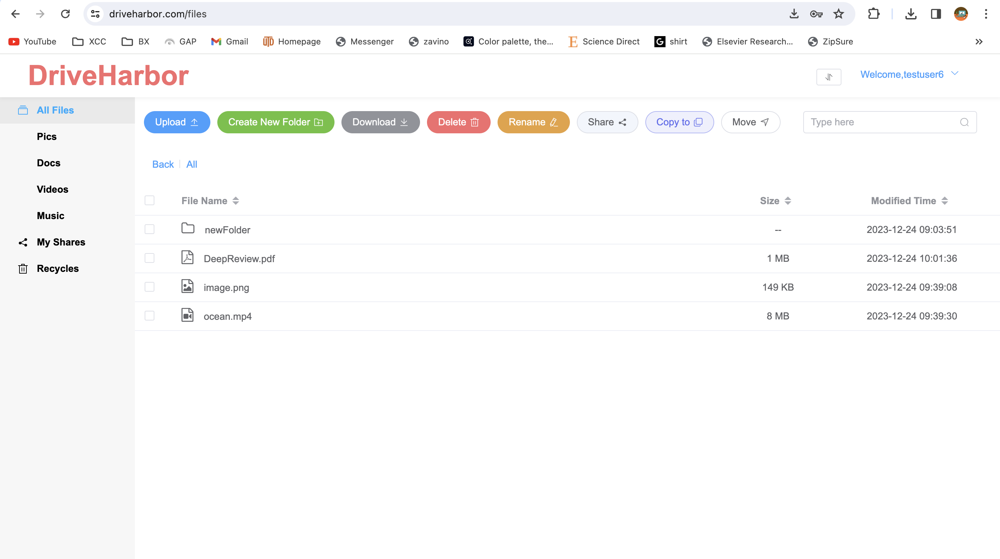

## Drive Harbor Introduction
This is a web application cloud file storage services. The client needs to create an account to use
the service. The two core functionalities are file storage and file sharing. This web applicat
ion was deployed on cloud. Its
 backend was built using Java Springboot. The frontend was built based on VUE.

The client can create folders, upload documents, rename the documents, preview the documents, download the documents and delete the documents.

### App Walkthrough

#### Create account

#### Login

#### Forgot password
The user needs to verify the username and security answer in order to update the password.

#### Main page

#### Upload

The clients can upload multiple documents at the same time. The uploaded docs will fall into four categories: pics, docs, videos and music.

#### Preview 

#### Download

The user can select multiple docs to download.

#### Rename

#### Create a new folder

#### Move docs to a folder

#### Delete docs

Delete docs will be moved to the recycle bin. The client will need to delete the docs in the recycle bin to delete the docs permanently. They can also restore the docs in the recycle bin. 

#### Empty the recycle bin

#### Share the docs
The other one with gets the open the link to the share that another user has created needs to be a registered user and also needs the share code to open the link. The user can choose to set the share to be valid for 7 days, 30 days or permanently. 
The users can look up the share records and also undo the share operations.

#### Undo the share operation

